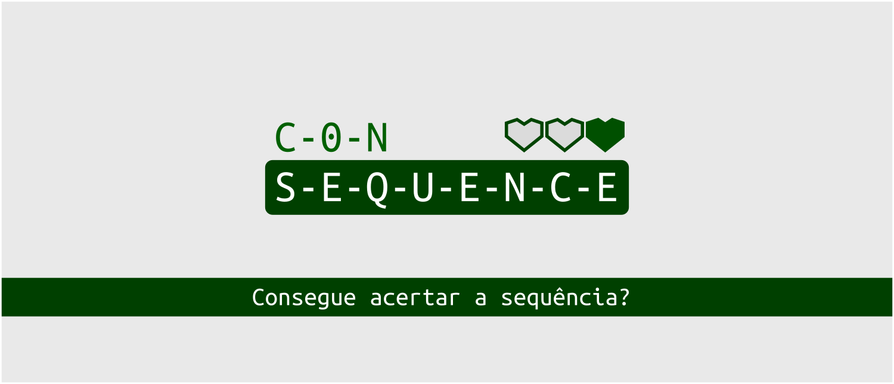

# ConSequence
  O ConSequence é um jogo de memorização, em que o jogador deve lembrar uma sequência de números e informá-la de maneira exata após um dado tempo. É permitido errar, mas você vai perder seus precioso corações...

  Esse é um projeto realizado para a disciplina de Eletrônica Digital, na graduação em Engenharia Eletrônica da UFPE. Foi utilizada a linguagem VHDL, sendo o mesmo desenvolvido para a DE115.

# Módulos
(Ainda não definido)

## Xorshift 
(Ainda não definido)
  
## NEC IR Controller 
(Ainda não definido)

## LCD Controller 
(Ainda não definido)

## Game Engine
(Ainda não definido)

# Versão
  0.1.1

# Roadmap
##0.x: 
  - [x] Estruturação do projeto
  - [ ] Implementação dos módulos auxiliares (Xorshift, Conversores, Multiplexadores, etc)

##1.x:
  - [ ] Implementação do driver para o controle infravermelho

##2.x:
  - [ ] Implementação do driver para o LCD

##3.x:
  - [ ] Implementação da engine do game

##4.x:
  - [ ] Implementação dos 4 níveis
